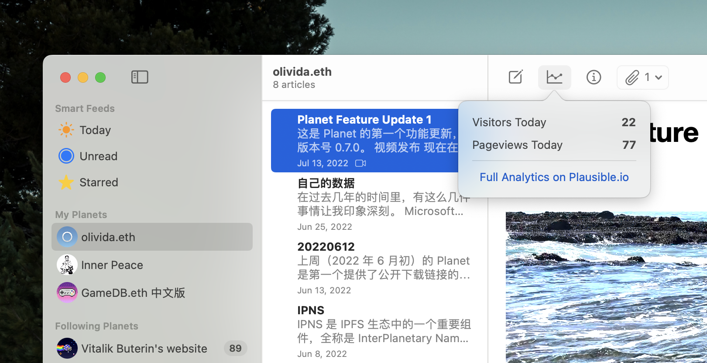
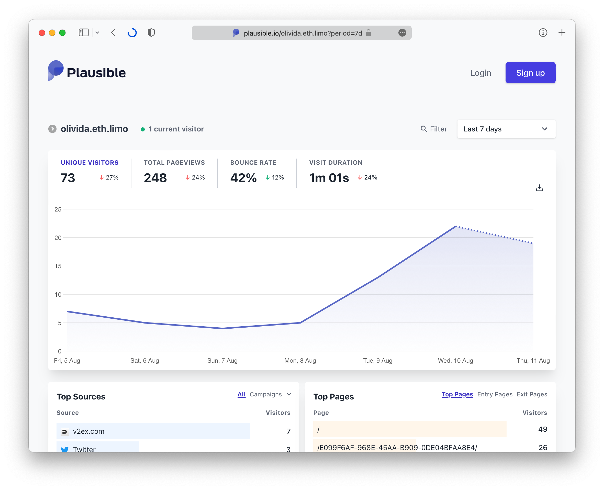
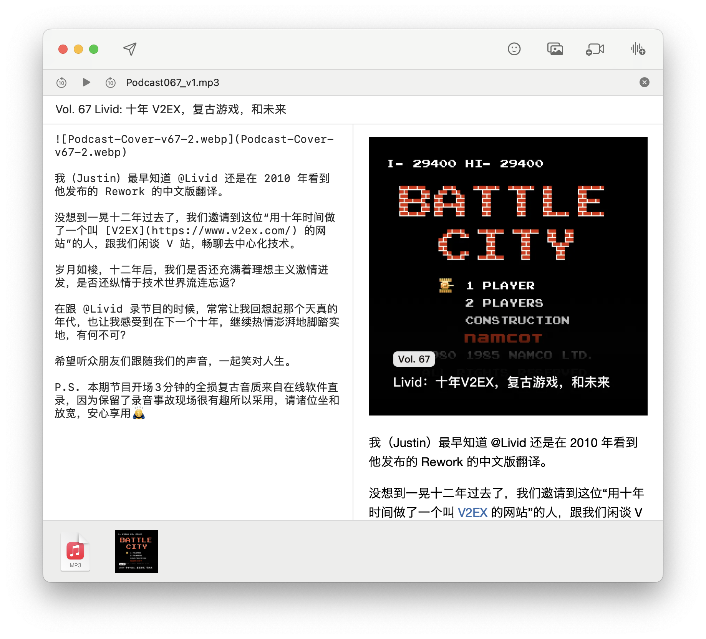
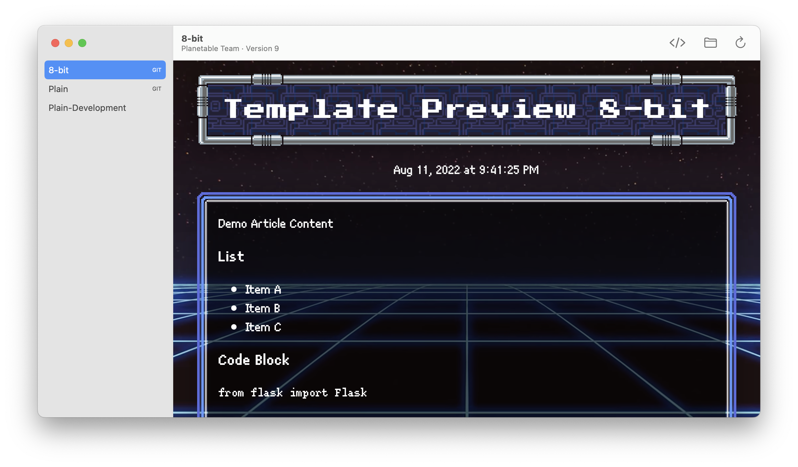
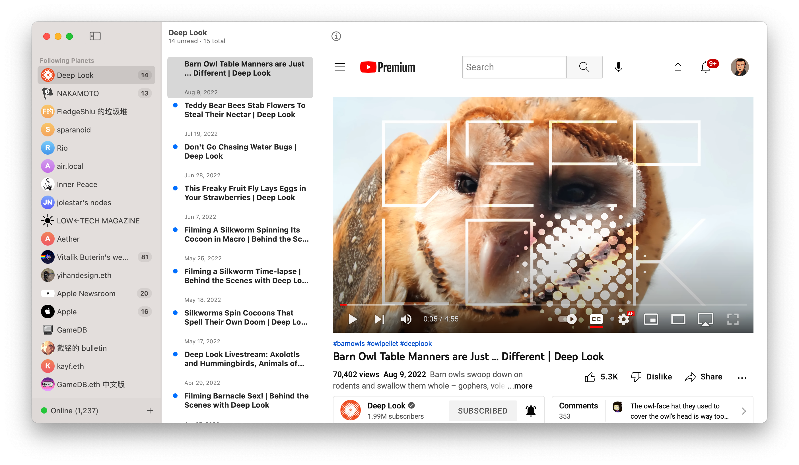

这是 Planet 的第二个功能更新，版本号 0.8.0，发布于 2022 年 8 月。下面是这个版本里带来的新功能和改进。这次的更新的代码来自于以下贡献者：

* [@stdc105](https://github.com/stdc105)
* [@kailuo](https://github.com/kailuo)
* [@livid](https://github.com/livid)

## Plausible.io 数据统计

[Plausible.io](https://plausible.io) 是一个开源的数据统计平台，创始团来自欧洲。现在 Planet 支持在 Info 面板中填入 Plausible 的 domain 和 API token，这样就可以通过 Plausible.io 看到有多少人访问过你的 Planet。

比如下面的链接是 [olivida.eth](https://olivida.eth.limo/) 的访问数据例子：

https://plausible.io/olivida.eth.limo

另外一个例子，Plausible.io 官方网站的流量：

https://plausible.io/plausible.io

Plausible.io 的实现方式是[尊重隐私](https://plausible.io/privacy-focused-web-analytics)的。这个平台不会收集个人信息，甚至都没有使用 cookie。因此不需要在使用 Plausible.io 的页面上弹出 cookie banner。

我们会在未来的版本更新中加入对 self-hosted 版本的 Plausible 的支持。

## 博客 Podcast 和附件支持

现在你可以在撰写内容时，选择附加一个音频文件，或者是直接将音频文件拖拽到写作窗口中。之后在发布时，页面上就会出现一个音频播放器。

在本篇博客的内容中，就附加了一段音频内容。这是我在 5 月份 Planet 上线之前，和 [枫言枫语播客](https://fyfy.fm) 录制的。里面分享了关于 Planet 在制作过程中的一些思考。

如果是在 0.8.0 之后版本的 Planet 客户端中访问这样的带有音频的内容，那么在工具栏中会看到一个耳机按钮，点击之后就会启动一个全局的音频播放器去播放内容中所携带的音频内容。得益于这个全局播放器的存在，播放时切换查看的文章内容，播放不会被打断。

我们会在未来的版本中继续优化这个全局音频播放器的使用体验。

如果你将其他格式的文件，比如 PDF 或者 DMG 之类拖拽进入写作窗口，那么这样的内容在发布之后，会在 0.8.0 的客户端中显示为附件。访客可以点击工具栏中的附件图标就可以下载。

## 内置模版的细节改进

Planet 目前内置了两个网站模版用于切换样式。

在这次的更新中，我们为这两个模版加入了众多的细节改进：

* 对音频内容的支持
* 针对视频和图片内容的 CSS 样式优化
* 在顶部区域，从内容页面返回到首页的链接
* 在 iOS 移动设备上访问时的 safe-area 问题
* Plain 主题首页对 Dark Mode 的支持

模版的功能完备是 Planet 的重要部分。所有的内置模版和 Planet App 一样，也都是开源软件，所以如果你发现任何模版相关的问题，也可以通过 GitHub Issues 甚至 PR 的方式反馈给我们：

* https://github.com/Planetable/SiteTemplatePlain
* https://github.com/Planetable/SiteTemplate8bit

接下来，我们会在 2022 年 8 月发布关于如何自己构建新模版的详细文档。

下面这个项目是来自开发者 [Fledge Shiu](https://github.com/FledgeXu) 的一个有意思的模版，实现了中文竖排的效果：

https://github.com/FledgeXu/Vertical

然后这里是一个用 8-bit 模版的关于经典老游戏的博客：

[https://zh.gamedb.eth.limo/](https://zh.gamedb.eth.limo/)

## 内置 go-ipfs 版本升级

Planet 内置的 go-ipfs 版本从 0.12 升级到了 0.14。从 0.13 版本开始，上游 Protocol Labs 将 go-ipfs 项目更名为了 [kubo](https://github.com/ipfs/kubo)，所以之后我们如果需要在文档中提到 go-ipfs，我们会使用它的新名字 kubo。

由于 kubo 的版本升级，会在 Planet 启动时有一个迁移仓库的操作。如果你的本地 IPFS repo 的文件数量较大，那么这个迁移可能会需要一些时间，让它跑一会就好。

我们会在未来的版本中提供更多针对本地 IPFS repo 的图形界面管理功能。

## RSS 订阅器相关的细节改进

其实从 Planet 的第一个发布版本开始，这个软件就是带有 RSS 订阅功能的。但是因为一些细节还不够好用，所以我们之前没有公开宣布过这个功能的存在。

在这次的 0.8.0 更新中，我们针对 RSS 订阅的很多细节功能做了改进和测试，所以现在我们可以有一些信心来邀请你试用一下。

这里有一些有趣的 RSS 订阅源：

* [Low Tech Magazine](https://solar.lowtechmagazine.com/): 一个完全靠太阳能驱动的网站，所以阴天的时候可能会断线。
* YouTube 上的 [Deep Look](https://www.youtube.com/c/KQEDDeepLook) 频道：各种有趣动物的 4K 科普视频

很多会持续更新内容的网站，很可能都带有 RSS 订阅地址，一个例子就是 YouTube 上的各类 Channel 的首页。你可以尝试直接把网址填入到 Follow Planet 那里，如果内容源上确实存在 RSS 地址，那么就可以用 Planet 订阅。

如果你在使用 RSS 订阅功能的过程中遇到问题，欢迎反馈到下面这些社区渠道：

* Telegram 上的 [Planet 中文用户群](https://t.me/+5bl7FIsxeChlOWIz)

## 提醒相关的细节改进

我们在这次更新中进一步改进了 Local Notification 的工作方式。现在如果你收到了订阅的 Planet 的内容更新提醒，那么点击 Notification 就可以直接跳转到这篇文章。

## 其他细节改进

* 更换了 Markdown 渲染引擎，现在 Planet 可以输出和 [GitHub Flavored Markdown](https://github.github.com/gfm/) 完全一致的结果，同时也解决了之前由于使用 [Ink](https://github.com/JohnSundell/Ink) 渲染所带来的一些 crash 问题。
* 现在在查看文章时，如果执行了任何的下载相关的操作，那么这些操作可以正常工作了，并且可以从一个新的 Download Manager 窗口中看到下载进度。之前的版本中由于缺乏对 WKDownloadDelegate 的实现而导致了下载相关的操作没有反应。
* 改进了对 DNSLink 加载内容的支持。值得注意的是，如果你希望以 DNSLink 方式订阅一个 IPFS 上的网站，那么需要在 Follow Planet 窗口使用 planet 协议，比如这样去输入域名 `planet://zu1k.com`。
* 从 Planet 发布的 IPNS 记录的 TTL 时间从 1 周调整到了 1 年。但 IPNS 记录在节点上的存在时间，依然取决于很多其他因素。所以，如果你希望保持你的 IPNS 记录有效，那么至少每周打开 Planet 运行一段时间，就肯定没有问题的。关于 IPNS 及 Pinning 这几个复杂而又重要的技术细节，我们会在接下来的一篇博客里详细介绍。

---

以上是本次 0.8.0 更新里的主要新功能和改进。如果你在使用中遇到问题，可以从以下社区渠道向开发者反馈或者寻求社区协助：

* V2EX 上的 [Planet 节点](https://www.v2ex.com/go/planet)
* Telegram 上的 [Planet 中文用户群](https://t.me/+5bl7FIsxeChlOWIz)

如果你十分确定遇到了软件实现上的 bug，那么可以通过 GitHub Issues 向我们描述如何复现 bug，我们会尽快调查和解决。

* GitHub 上的 [Planet 项目](https://github.com/Planetable/Planet)